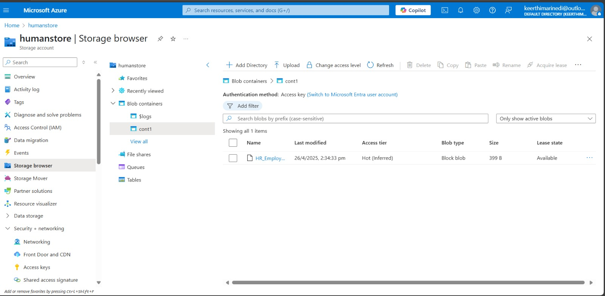

# HR Analytics Dashboard

## Project Overview
This project focuses on analyzing employee-related data to understand workforce patterns and HR metrics. The dashboard helps in identifying trends related to employee performance, attrition, and organizational insights.

## Objectives
- Analyze employee data for HR decision-making  
- Identify patterns in workforce behavior  
- Support data-driven HR strategies  

## Key Highlights
- Visual analysis of employee data
- Dashboard-based insights for HR teams
- Clear representation of HR metrics

## Tools & Approach
- CSV-based HR dataset
- Data preprocessing and analysis
- Dashboard visualizations for insights

## Outcome
The project provides a visual and analytical view of HR data that can assist organizations in understanding workforce trends and improving HR planning.

---

